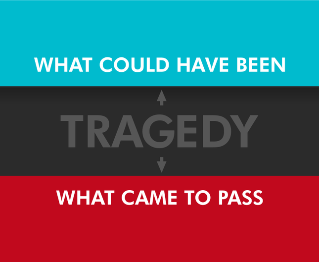
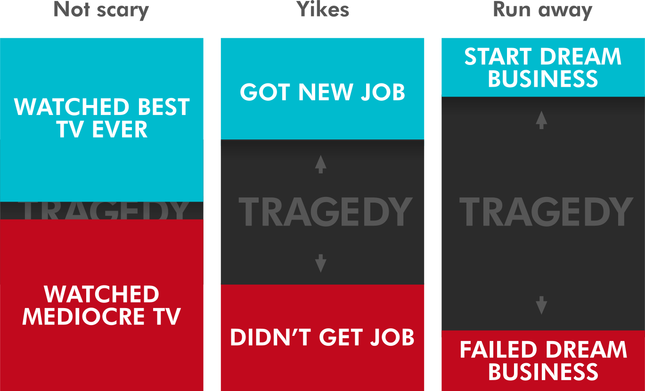

**Every tragedy ever can be reduced to two words: potential, lost.**

Romeo and Juliet is tragic because two lovers so nearly lived out their hearts and dreams, and lost everything. The tragedy is not their death: it’s the gap with what could have been instead.

"We could have had it all" sung Adele, and in six words she summed up every heartbreak ever: the feeling of something that could have been, but was not.

Our brains are wired to work this way. We’re more moved by the death of a promising young teenager than an elderly drug addict. Potential matters.

And so it is with our lives. If tragedy is so sorely felt, the surest way to feel bad about yourself is to fall short of your own potential. Imagine you’ve made it to the final question of Who Wants To Be A Millionaire, and when asked the correct spelling of “Bieber” you flub it. You’re still far richer than you were an hour ago, but you probably feel like something you scraped out of a drainpipe.

We feel surprisingly bad if we fail a job interview, mess up a date, or even pick the slower route to work. A cool head might say all these things were ‘good learning experiences’, but that doesn’t mean they doesn’t feel like crap.

Well, tough. Brains be stupid.

The problem with our instinctive sense of tragedy is it teaches us to avoid anything where a potential gain might be lost. The bigger the potential gain, the greater our aversion:

Take young Walt. Walt is an awkward, lonely soul, afraid to approach any girl he likes. To anyone but him, clearly the fastest, best way he could improve his lot would be to just try anyway. Fail and try again. If he could bring himself to do this consistently, he’d probably be Captain Prince Darcy Charming before a year was out. Yet he couldn’t imagine anything more terrifying.

He’s torn between aversion to two tragedies. The immediate tragedy of “oh no, I could have married that girl and had lots of babies”, and the later one of “I will die alone, unloved, eaten by my pet snake”.

We love to fixate on the immediate, and the paralysing aversion to losing something he hasn’t even got yet will likely keep Walt alone for some time.  As the years roll by, he will have to either defeat his tragedy, or succumb to it.

Because here’s the rub. You can make a habit of avoiding potential loss. Most of us get excruciatingly good at this. But one day, there will be a tragedy you can’t dodge. The gap between what you could have been, and what you were.

I hope you’re ready.

> This article is taken from [this topic on Quora](http://abetterlife.quora.com/You-will-still-be-here-tomorrow-but-your-dreams-may-not).
